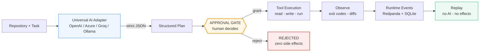
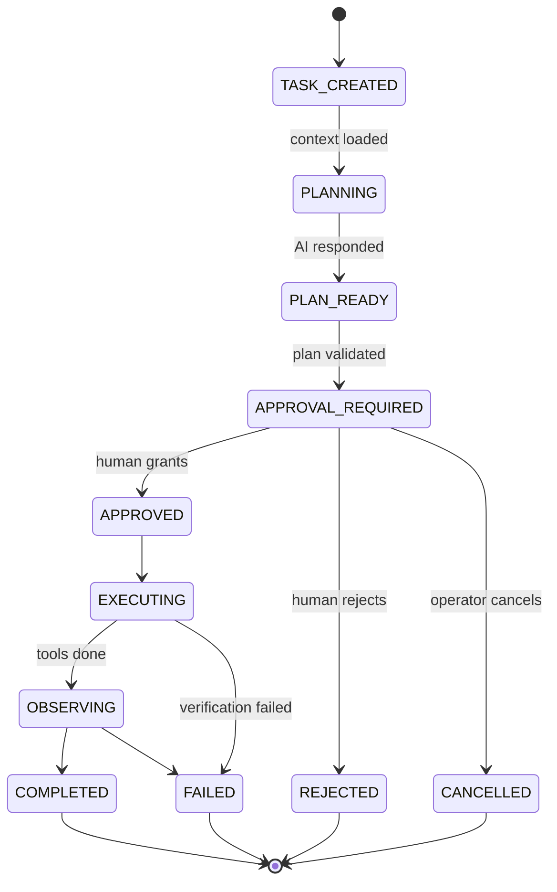
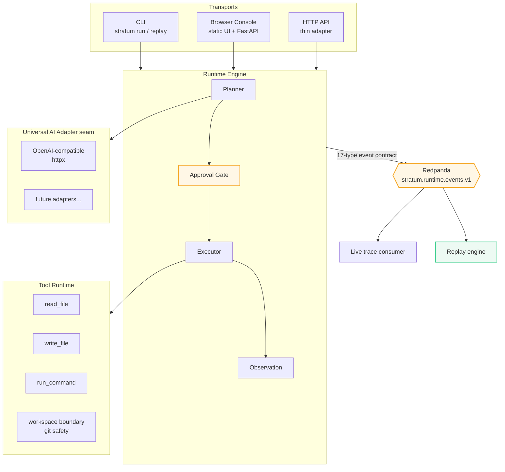

# Stratum

[](https://www.python.org/)
[](https://redpanda.com/)
[](https://sqlite.org/)
[](#quick-start)
[](#testing--proof-of-reality)

**A local-first execution runtime for AI-assisted engineering work.**

Stratum turns `repository + task` into a **structured plan**, puts a **human approval gate** between planning and any side effect, executes approved plans with real tools against real files, records every transition as **durable events**, and replays any execution from that history.

```text
Nothing is observable until something actually happened.
Nothing can be approved unless something was proposed.
Nothing can be proposed unless a real provider produced it.
Nothing can be executed unless it passed the approval boundary.
```

---

## The Execution Spine

Every task flows through one non-negotiable pipeline. The human sits structurally between proposal and side effect:



The gate is **structural, not conventional**: the executor is unreachable in code until an approval record exists for the pending plan.

## Lifecycle State Machine



Every transition is caused by a real runtime action and emits a durable event. A crash while `APPROVAL_REQUIRED` is recoverable — pending approvals survive restarts via the SQLite projection.

## Architecture

One small engine at the center; everything else is an adapter or a consumer:



Seams with exactly one real implementation each — `AIAdapter`, `EventPublisher`, `Tool`, `ApprovalPolicy`, transports — so new providers or transports require **zero core changes**.

## Core Features

- **Structural approval gate** — the engine refuses execution without a recorded human decision for the exact pending plan. Rejection provably touches nothing.
- **Real provider interaction** — strict-JSON structured planning against any OpenAI-compatible endpoint; invalid model output fails loudly before approval exists. Grounded write materialization performs one additional real provider call using actual file contents from the read step.
- **Durable, replayable events** — 17-type versioned contract, per-execution sequence + correlation/causation chain, published to Redpanda (partitioned by `execution_id`) and indexed locally in SQLite.
- **Restart-safe state** — kill the server mid-approval; on restart the engine hydrates pending executions and the plan is approvable as if nothing happened. Resumed runs never call the provider again.
- **Real tools, real effects** — file reads/writes with sha256 + unified diff artifacts, subprocess verification with exit codes recorded as observations, fail-stop semantics.
- **Replay without consequences** — any execution reconstructs its full narrative from events alone: no AI calls, no filesystem effects.
- **Two thin transports** — interactive CLI and a zero-build browser console over the same engine. No framework lock-in.

## Quick Start

### Prerequisites

- Python 3.11+
- Docker (for local Redpanda)
- An AI provider key — Groq, OpenAI, Azure OpenAI, OpenRouter, Ollama, vLLM… anything speaking `/chat/completions`

### Step 1 — Clone & configure

```bash
git clone https://github.com/mailtotanvir/stratum.git
cd stratum

# provider credentials are resolved as matched pairs:
export GROQ_API_KEY="your-key"                    # simplest path
#   or STRATUM_PROVIDER_BASE_URL + STRATUM_PROVIDER_API_KEY
#   or OPENAI_API_KEY (+ OPENAI_API_BASE for Azure)
```

### Step 2 — Install

```bash
cd stratum
uv venv .venv --python 3.11 && uv pip install -e '.[dev,api]'
source .venv/bin/activate
stratum doctor        # verifies provider, model, broker, git
```

### Step 3 — Start the event broker

```bash
docker compose -f docker-compose.redpanda.yml up -d
export STRATUM_KAFKA_BROKERS=127.0.0.1:9092
```

### Step 4 — Run your first transformation

```bash
printf 'y\n' | stratum run \
  --repo ./example-repo \
  --task 'Change the greeting returned by hello.py from "Hello" to "Hello Stratum" and update the test accordingly.' \
  --file hello.py --file test_hello.py \
  --brokers 127.0.0.1:9092
```

You will see:

```text
Repository validated.

Planning...

PLAN
* 2. [write_file] Write updated hello.py ...      (* = mutates repo)

Approve plan for exe_mt4oq87s-kkrlpg49? [y/N] y

Executing...
  [+] read hello.py (86 bytes)
  [+] updated hello.py (94 chars)
  [+] `python -m pytest -q` exited 0

Task COMPLETED.
Execution ID: exe_mt4oq87s-kkrlpg49
```

Answering `n` rejects the plan — nothing is ever written without you.

### Step 5 — Replay it

```bash
stratum replay exe_mt4oq87s-kkrlpg49 --brokers 127.0.0.1:9092
```

```text
Execution exe_mt4oq87s-kkrlpg49
  Task:     Change the greeting ...
  Plan (5 steps): ...
  Approval: granted by cli-operator
  [+] 18:01:38 read_file - read hello.py (86 bytes)
  [+] 18:01:38 write_file - updated hello.py (94 chars)
  [+] 18:01:38 run_command - `pytest -q` exited 0
  Status:   COMPLETED

(26 events replayed; no AI calls, no side effects)
```

### Step 6 — Browser console

```bash
stratum serve --port 8899 --brokers 127.0.0.1:9092
# open http://127.0.0.1:8899
```

Submit tasks through a form, approve/reject real plans with buttons, watch the live event timeline, browse execution history, replay any run. The console holds no state of its own — it is just another client of the same engine.

## Observability & Replay

Every meaningful transition emits one of **17 typed events** (`task.created`, `ai.requested/responded`, `plan.generated`, `approval.granted/rejected`, `tool.started/completed/failed`, `artifact.created`, `observation.recorded`, `task.completed/failed/cancelled`, …) carrying:

```text
event_id · event_type · event_version · task_id · execution_id
timestamp · sequence · producer · payload · correlation_id · causation_id
```

Watch it live:

```bash
stratum consume --brokers 127.0.0.1:9092 --follow
```

```text
18:19:37 ai.requested planning model=openai/gpt-oss-20b
18:19:38 ai.responded planning tokens=1083 latency=906ms
18:19:38 plan.generated 3 steps
18:19:38 approval.requested
18:19:39 approval.granted by cli-operator
18:19:39 tool.started write_file - hello.py
18:19:39 tool.completed - updated hello.py (94 chars)
18:19:40 task.completed steps_ok=3/3
```

## Persistence Model

| Store | Role |
|---|---|
| **Redpanda** | Authoritative stream when configured. Topic `stratum.runtime.events.v1`, keyed by `execution_id` so each execution's history stays totally ordered |
| **SQLite** | Local event index + execution-state projection (2 tables, WAL, stdlib). Powers fast history queries and crash recovery |

No competing source of truth: every SQLite row is derivable from events.

## Safety Model

- Mutating steps are forced `requires_approval`; executor structurally unreachable otherwise
- Paths resolve strictly inside the target workspace — escapes refused
- Git branch/HEAD/status captured at creation as rollback reference
- File writes produce artifact events with before/after sha256 + unified diff
- Verification commands that exit non-zero fail the execution — honestly recorded
- Secrets never appear in events (asserted by tests)

## Testing & Proof of Reality

```bash
STRATUM_KAFKA_BROKERS=127.0.0.1:9092 pytest
# 61 tests incl. two live acceptance paths:
#   * real provider transforms a real repository end-to-end
#   * events round-trip through real Redpanda and replay identically
```

**Is it really calling an LLM?** Prove it yourself:

```bash
# every AI call records the provider's own request id + token usage:
sqlite3 .stratum-data/stratum.db \
  "SELECT payload_json FROM events WHERE event_type='ai.responded' LIMIT 1;"
# -> {"request_id": "chatcmpl-32ead6b1-...", "usage": {...}, "latency_ms": 1115}

# negative control — a mock cannot make a live provider do this:
STRATUM_PROVIDER_API_KEY=bogus stratum run --repo ./example-repo --task t
# -> Task failed: provider returned 401: invalid_api_key
```

## Repository Layout

```text
stratum/
├── uat.sh                        # one-command full-system acceptance run
├── UAT_RUNBOOK.md                # manual acceptance script + troubleshooting
├── MIGRATION.md                  # v1 -> v2 keep/rewrite/quarantine verdicts
├── STRATUM_EXECUTION_FIRST_REBUILD.md   # the directive that drove v2
├── docker-compose.redpanda.yml   # local Kafka-compatible broker
└── stratum/                      # the runtime package
    ├── src/stratum/
    │   ├── engine.py             # lifecycle orchestrator + guards
    │   ├── events.py             # RuntimeEvent contract (v1)
    │   ├── planning.py           # Plan model + strict validation
    │   ├── ai.py                 # universal adapter protocol
    │   ├── adapters/
    │   │   └── openai_compatible.py
    │   ├── tools.py              # tool boundary + workspace safety
    │   ├── approval.py           # approval policies
    │   ├── store.py              # SQLite index + projection
    │   ├── redpanda.py           # Kafka producer/consumer
    │   ├── journal.py            # legacy NDJSON reference
    │   ├── replay.py             # pure event fold + narrative
    │   ├── context.py            # bounded repo context loader
    │   ├── materialize.py        # grounded write generation
    │   ├── cli.py                # run / replay / consume / serve / doctor
    │   ├── api.py                # thin FastAPI transport
    │   └── web/                  # zero-build browser console
    └── tests/                    # unit + vertical + gated acceptance
```

## Technology Stack

| Layer | Technology |
|---|---|
| Runtime | Python 3.11, asyncio, dataclasses — no frameworks |
| Provider transport | httpx against OpenAI-compatible `/chat/completions` |
| Event streaming | Redpanda (Kafka API) via kafka-python-ng |
| Persistence | SQLite (stdlib), WAL mode, schema-versioned |
| Web | FastAPI + vanilla HTML/CSS/JS (zero build step) |
| Testing | pytest + pytest-asyncio, live acceptance gates |

## Documentation

- [stratum/README.md](./stratum/README.md) — runtime usage deep-dive
- [stratum/ARCHITECTURE.md](./stratum/ARCHITECTURE.md) — module map, event contract, invariants
- [MIGRATION.md](./MIGRATION.md) — what was kept, rewritten, quarantined in the v1 → v2 rebuild

> ⚠️ `backend/` and `desktop/` are **quarantined v1 code**, kept for reference only — they are not on any runtime path.

## Status & Roadmap

- ✅ Execution spine, approval boundary, durable events, replay, persistence, CLI + web transports
- 🔭 Next: richer tool vocabulary (patch-based edits), streaming plan progress over SSE, additional provider adapters behind the existing seam
