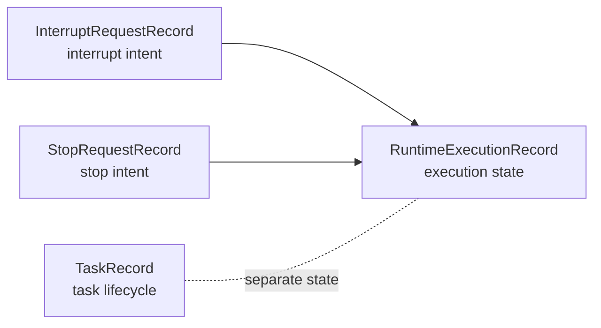

# ADR: Runtime Control Requests

## Status

Accepted for Stratum v1 runtime boundary plumbing.

## Context

Stratum now has durable runtime control objects for interrupt and stop requests.
These controls are part of the runtime boundary, not task lifecycle state.

Runtime execution state is tracked separately from task lifecycle status:

- `TaskRecord` tracks the product-level task lifecycle.
- `RuntimeExecutionRecord` tracks the current runtime execution state for a
  task.
- `InterruptRequestRecord` and `StopRequestRecord` track operator or system
  control intent.

## Current Semantics

Interrupt requests are persisted as `InterruptRequestRecord` rows. Stop requests
are persisted as `StopRequestRecord` rows.

Both request types emit durable runtime events:

- interrupt: `interrupt_requested`, `interrupt_applied`, `interrupt_ignored`
- stop: `stop_requested`, `stop_applied`, `stop_ignored`

`PythonAsyncRuntime.interrupt()` currently creates an interrupt request, applies
it immediately, transitions `RuntimeExecutionRecord` to `interrupted`, and emits
`runtime_task_interrupted`.

`PythonAsyncRuntime.stop()` currently creates a stop request, applies it
immediately, transitions `RuntimeExecutionRecord` to `stopped`, and emits
`runtime_task_stopped`.

Immediate application is temporary. It exists because Stratum does not yet have a
real execution loop that can observe queued controls while work is running.

## Why Durable Control Objects

Durable control objects give Stratum:

- auditability of who or what requested runtime control
- traceability through persisted events and task-filtered traces
- a path to future asynchronous application by the runtime loop
- a path to future human/operator review before applying controls
- a path to future policy enforcement that can create, apply, or ignore controls

## State Separation

Runtime control requests must not mutate task lifecycle status directly.

`TaskRecord` answers what the product task is doing from the user-facing task
perspective. `RuntimeExecutionRecord` answers what the runtime is currently doing
with that task. `InterruptRequestRecord` and `StopRequestRecord` answer what
control intent has been requested and whether that intent was applied or ignored.

## Future Behavior

Once the real runtime loop exists, interrupt and stop requests may be queued
first, observed by the loop, and then applied by the loop at a safe boundary.

Future semantics may include:

- stop becoming terminal for a runtime execution
- interrupt supporting resume later
- governance creating control requests automatically
- policy deciding whether requests are applied, ignored, or escalated

## Non-Goals

This ADR does not introduce:

- resume
- tool cancellation
- subprocess killing
- approval queues
- UI
- BEAM, Elixir, or Kafka implementation
