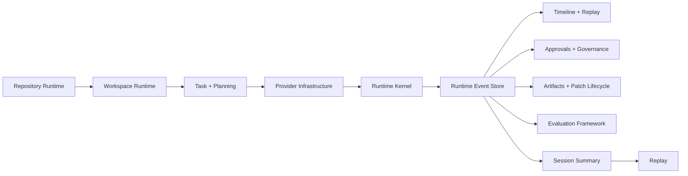
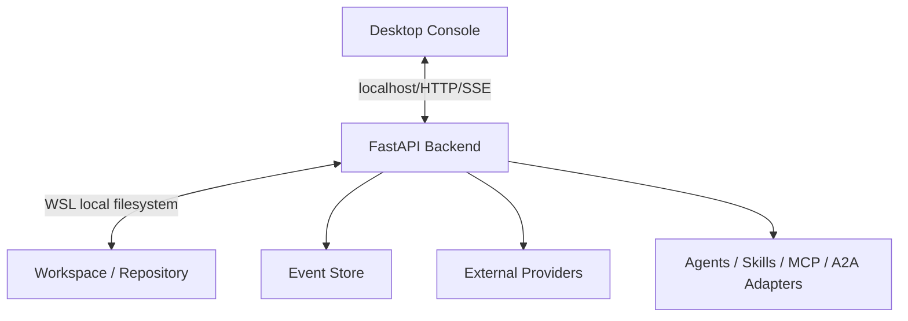

# Architecture Guide

## Platform Shape

Stratum is organized around an event-first runtime:

1. Runtime Kernel schedules and coordinates execution.
2. Runtime Event Store records authoritative history.
3. Runtime Sessions bind work to a governed execution context.
4. Workspace and Repository runtimes expose local engineering context.
5. Provider infrastructure isolates model and transport differences.
6. Universal Execution Fabric keeps execution participant abstraction stable.
7. Agent Marketplace and Skills provide extensibility without core lock-in.
8. Evaluation, artifacts, and projections are deterministic derived state.

## Freeze Rules

- No feature additions in RC1.
- No new public surface without corresponding documentation and validation.
- All projections must be reconstructable from the event store and linked artifacts.
- The backend remains the runtime authority; the desktop remains an operator client.

## Diagrams

### Runtime Flow

### Architecture Boundary

